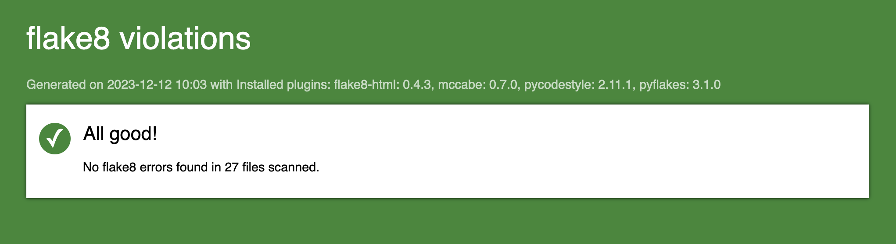

[![oc-project-shield][oc-project-shield]][oc-project-url]

[oc-project-shield]: https://img.shields.io/badge/OPENCLASSROOMS-PROJECT-blueviolet?style=for-the-badge
[oc-project-url]: https://openclassrooms.com/fr/paths/518-developpeur-dapplication-python

# Openclassrooms - Développeur d'application Python - Projet 9

Développez une application Web en utilisant Django


## Compétences évaluées

- :bulb: Développer une application web en utilisant Django
- :bulb: Utiliser le rendu côté serveur dans Django

## Installation et exécution du projet

### Pré-requis

- Avoir `Python` et `pip` installé sur sa machine.

1. Cloner le repo

```sh
git clone https://github.com/Gregson971/oc-da-python-p9.git
```

2. Se placer dans le dossier oc-da-python-p9/litrevu

```sh
cd /oc-da-python-p9/litrevu
```

3. Créer l'environnement virtuel

```sh
python -m venv env
```

4. Activer l'environnement virtuel \
   Si vous utilisez Mac ou Linux

```sh
source env/bin/activate
```

Si vous utilisez Windows

```sh
env\Scripts\activate.bat
```

5. Installer les packages requis

```sh
pip install -r requirements.txt
```

6. Lancer le serveur Django

```sh
python manage.py runserver
```

7. Dans le navigateur de votre choix, se rendre à l'adresse http://127.0.0.1:8000/

### Django administration

&rarr; http://127.0.0.1:8000/admin/

Identifiant : **Admin** | Mot de passe : **litrevu2023**

### Liste des utilisateurs existants

| _Identifiant_ | _Mot de passe_ |
| ------------- | -------------- |
| JohnDoe       | P@$$word123    |
| JaneDoe       | P@$$word123    |
| BobLeponge    | P@$$word123    |
| BruceLee      | P@$$word123    |
| ChuckNorris   | P@$$word123    |
| LisaSimpson   | P@$$word123    |

### Fonctionnalités

- Se connecter et s'inscrire ;
- Modifier les informations de son profil ;
- Modifier son mot de passe ;
- Consulter un flux contenant les tickets et critiques des utilisateurs auxquels on est abonné ;
- Créer des tickets de demande de critique ;
- Créer un billet et une critique sur ce même billet en une seule étape, pour créer des critiques « à partir de zéro » ;
- Créer des critiques, en réponse ou non à des tickets ;
- Voir ses propres posts, les modifier ou les supprimer ;
- Suivre d'autres utilisateurs, ou se désabonner.

### Générer un rapport flake8-html

```sh
flake8 --format=html --htmldir=flake-report
```


